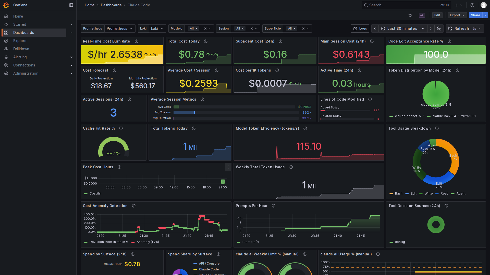

# Claude Usage Monitor

Stack de monitorización en tiempo real del gasto de tokens y del coste de Claude, con Docker Compose y un dashboard de Grafana ("Claude Code") que se provisiona solo al arrancar.

| Fuente | Cómo llega | Tipo |
|---|---|---|
| **Claude Code** | Telemetría OpenTelemetry (OTLP) → Collector → Prometheus (métricas) + Loki (eventos) | Automático |
| **API de Anthropic / Console** | `usage-exporter` consulta cada 5 min la Admin API (`usage_report/messages` + `cost_report`) | Automático (requiere Admin key) |
| **claude.ai web / móvil** | `log-usage.sh` o el formulario `/form` → Pushgateway | Manual |

```
Claude Code ──OTLP gRPC :4317 / HTTP :4318──► otel-collector ──► :8889 ◄── Prometheus ◄── Grafana :3000
                                                   └── logs ──► Loki :3100 ◄──────────────────┘
Admin API ◄── usage-exporter :9101 (/metrics, /form) ◄── Prometheus
log-usage.sh / formulario ──► Pushgateway :9091 ◄── Prometheus
```



## Estructura

```
claude-usage-monitor/
├── docker-compose.yml
├── .env.example
├── log-usage.sh                       # registro manual claude.ai
├── otel-collector/otel-collector-config.yaml
├── prometheus/prometheus.yml
├── loki/loki-config.yaml
├── usage-exporter/                    # Python sin dependencias
│   ├── Dockerfile
│   ├── exporter.py                    # Admin API -> /metrics, POST /manual -> Pushgateway
│   └── form.html                      # formulario móvil (/form)
└── grafana/
    ├── grafana.ini                    # feature toggles (menú lateral, Loki)
    ├── entrypoint.sh                  # aplica los umbrales de alerta de .env
    ├── build_dashboard.py             # genera dashboards/claude-code.json
    ├── dashboards/claude-code.json
    └── provisioning/
        ├── datasources/datasources.yaml   # Prometheus (uid prometheus) + Loki (uid loki)
        ├── dashboards/dashboards.yaml
        └── alerting/alerts.yaml           # burn rate, gasto diario, % semanal claude.ai
```

## Arranque

```bash
cd claude-usage-monitor
cp .env.example .env          # opcional: ANTHROPIC_ADMIN_KEY, precio del plan, umbrales
docker compose up -d --build
docker compose ps             # los 6 servicios en "Up"
```

Grafana: <http://localhost:3000> (admin / admin). El dashboard **Claude Code** es la página de inicio.

| Servicio | URL |
|---|---|
| Grafana | http://localhost:3000 |
| Prometheus | http://localhost:9090 |
| Loki | http://localhost:3100 |
| Pushgateway | http://localhost:9091 |
| usage-exporter | http://localhost:9101/metrics · http://localhost:9101/form |
| Collector (métricas Prometheus) | http://localhost:8889/metrics |

## 1. Activar la telemetría de Claude Code

Exporta estas variables en la shell desde la que lanzas `claude` (o ponlas en el bloque `env` de `~/.claude/settings.json`):

```bash
export CLAUDE_CODE_ENABLE_TELEMETRY=1
export OTEL_METRICS_EXPORTER=otlp
export OTEL_LOGS_EXPORTER=otlp
export OTEL_EXPORTER_OTLP_PROTOCOL=grpc
export OTEL_EXPORTER_OTLP_ENDPOINT=http://localhost:4317
export OTEL_METRIC_EXPORT_INTERVAL=5000
# opcional: eventos más rápidos (por defecto 5000 ms)
export OTEL_LOGS_EXPORT_INTERVAL=2000
```

Equivalente en `~/.claude/settings.json`:

```json
{
  "env": {
    "CLAUDE_CODE_ENABLE_TELEMETRY": "1",
    "OTEL_METRICS_EXPORTER": "otlp",
    "OTEL_LOGS_EXPORTER": "otlp",
    "OTEL_EXPORTER_OTLP_PROTOCOL": "grpc",
    "OTEL_EXPORTER_OTLP_ENDPOINT": "http://localhost:4317",
    "OTEL_METRIC_EXPORT_INTERVAL": "5000"
  }
}
```

Si hay un proxy HTTP en tu entorno, añade `localhost` a `NO_PROXY`.

Claude Code exporta con temporalidad **delta** por defecto. El collector la convierte a acumulada (`deltatocumulative`), así que no tienes que cambiar nada.

### Métricas y eventos usados

Los nombres están comprobados en la [documentación oficial de Monitoring](https://code.claude.com/docs/en/monitoring-usage) y en lo que expone el collector:

| Métrica OTel (Claude Code) | Nombre en Prometheus | Labels usados |
|---|---|---|
| `claude_code.cost.usage` (USD) | `claude_code_cost_usage_USD_total` | `model`, `query_source` (main/subagent/auxiliary), `session_id` |
| `claude_code.token.usage` (tokens) | `claude_code_token_usage_tokens_total` | `type` (input/output/cacheRead/cacheCreation), `model` |
| `claude_code.session.count` | `claude_code_session_count_total` | `session_id` |
| `claude_code.lines_of_code.count` | `claude_code_lines_of_code_count_total` | `type` (added/removed), `model` |
| `claude_code.code_edit_tool.decision` | `claude_code_code_edit_tool_decision_total` | `decision`, `source`, `tool_name` |
| `claude_code.active_time.total` (s) | `claude_code_active_time_seconds_total` | `type` (user/cli) |

Los eventos llegan a Loki con `service_name="claude-code"`, y sus atributos quedan como *structured metadata* (`event_name`, `tool_name`, `source`, `session_id`…):

```logql
{service_name="claude-code"} | event_name="tool_result"
```

Eventos usados: `user_prompt` (Prompts Per Hour), `tool_result` (Tool Usage Breakdown) y `tool_decision` (Tool Decision Sources).

> **Nota sobre los totales.** Cada sesión de Claude Code crea series nuevas, y `increase()` de Prometheus pierde la primera muestra de una serie nueva (con una sesión corta puede quedarse en la mitad). Por eso el dashboard calcula los totales como `max_over_time(x[w]) - (x offset w or 0)` por serie, que da el incremento exacto.

## 2. API / Console (Admin API)

1. Crea una **Admin key** (`sk-ant-admin…`) en Console → Settings → Admin keys. Solo pueden hacerlo los administradores de la organización.
2. Ponla en `.env` como `ANTHROPIC_ADMIN_KEY=` y ejecuta `docker compose up -d usage-exporter`.

Endpoints consultados cada `POLL_INTERVAL_SECONDS` (300 s por defecto), con buckets de 1 día de los últimos `LOOKBACK_DAYS` días (máx. 31):

- `GET /v1/organizations/usage_report/messages?group_by[]=model&group_by[]=api_key_id&group_by[]=workspace_id`: campos `uncached_input_tokens`, `output_tokens`, `cache_read_input_tokens` y `cache_creation.ephemeral_5m_input_tokens` + `ephemeral_1h_input_tokens`.
- `GET /v1/organizations/cost_report?group_by[]=workspace_id&group_by[]=description`: campo `amount`, que viene en **centavos** como string decimal (el exporter lo divide entre 100).

Métricas expuestas en `:9101/metrics`:

| Métrica | Labels |
|---|---|
| `anthropic_api_tokens` | `date`, `model`, `api_key_id`, `workspace_id`, `type` (input/output/cache_read/cache_creation) |
| `anthropic_api_tokens_today` | `model`, `api_key_id`, `workspace_id`, `type` |
| `anthropic_api_cost_usd` | `date`, `workspace_id`, `model`, `cost_type`, `token_type` |
| `anthropic_api_cost_today_usd` | `workspace_id`, `model` |
| `anthropic_admin_api_enabled`, `anthropic_admin_api_last_success_timestamp_seconds`, `anthropic_admin_api_errors_total` | — |

`cost_report` no permite agrupar por `api_key_id`, así que **por API key solo hay tokens**. El coste se desglosa por workspace y modelo.

Sin `ANTHROPIC_ADMIN_KEY`, el exporter publica `anthropic_admin_api_enabled 0`, no hace ninguna petición y sigue sirviendo el formulario. Los paneles de la API muestran "No data", y nada más se rompe.

## 3. claude.ai web / móvil (manual)

claude.ai no tiene API de uso, así que copias a mano los porcentajes de **Ajustes → Uso**:

```bash
./log-usage.sh web 42 15       # 42 % del límite semanal, 15 % de la sesión actual
./log-usage.sh movil 38        # solo el semanal
PUSHGATEWAY_URL=http://mi-servidor:9091 ./log-usage.sh web 60
```

Cada llamada publica `claude_ai_usage_percent{surface="web|movil", window="weekly|session"}` en el Pushgateway, que guarda los valores en disco.

**Desde el móvil:** abre `http://<IP-del-equipo>:9101/form` (misma red o VPN/Tailscale) y añádelo a la pantalla de inicio. El formulario hace la misma llamada que el script.

`CLAUDE_AI_PLAN_MONTHLY_USD` (en `.env`) es el precio de tu plan. Solo se usa para prorratear un "gasto" diario de claude.ai en el panel *Spend by Surface*.

## Dashboard "Claude Code"

Rejilla de 24 columnas, tema oscuro, refresco cada 5 s y rango por defecto *Last 30 minutes*. Las variables son `Prometheus` y `Loki` (datasource), `Modelo`, `Sesión` y `Superficie` (web/movil de claude.ai), más el enlace **Logs ↗** a Explore/Loki.

| Panel | Fuente | Tipo |
|---|---|---|
| Real-Time Cost Burn Rate · Total Cost Today · Subagent Cost (24h) · Main Session Cost (24h) · Code Edit Acceptance Rate % | Claude Code (Prometheus) | Automático |
| Cost Forecast · Average Cost / Session · Cost per 1K Tokens · Active Time (24h) · Token Distribution by Model (24h) | Claude Code (Prometheus) | Automático |
| Active Sessions (24h) · Average Session Metrics · Lines of Code Modified | Claude Code (Prometheus) | Automático |
| Cache Hit Rate % · Total Tokens Today · Model Token Efficiency · Peak Cost Hours · Weekly Total Token Usage · Cost Anomaly Detection · Tokens by Type | Claude Code (Prometheus) | Automático |
| Tool Usage Breakdown · Prompts Per Hour · Tool Decision Sources (24h) | Claude Code (Loki) | Automático |
| API Cost per Day · API Cost by Model (31d) · API Tokens Today by API Key / Workspace | Admin API | Automático (con Admin key) |
| Spend by Surface (24h) · Spend Share by Surface | Claude Code + Admin API + plan claude.ai | Mixto (claude.ai manual) |
| claude.ai Weekly Limit % (manual) · claude.ai Usage % (manual) | Pushgateway | **Manual** |

Los paneles se definen en `grafana/build_dashboard.py`. Para cambiarlos, edita el script y ejecuta `python3 grafana/build_dashboard.py`. Grafana recarga el JSON en ≤ 30 s.

> **Coste estimado.** El coste de Claude Code (`claude_code.cost.usage`) es una **estimación** que hace el cliente con precios de API. Con una suscripción (Pro/Max) **no es lo que pagas**: sirve como medida relativa de consumo. Lo facturado de verdad en la API/Console sale del `cost_report` de la Admin API.

## Alertas

Están provisionadas en la carpeta **Claude** de Grafana Alerting. Los umbrales se configuran en `.env`:

| Alerta | Variable | Por defecto |
|---|---|---|
| Burn rate de Claude Code > X $/hr | `ALERT_BURN_RATE_USD_HR` | 5 |
| Gasto de Claude Code (24 h) > X $ | `ALERT_DAILY_COST_USD` | 20 |
| % semanal de claude.ai > X % | `ALERT_CLAUDE_AI_WEEKLY_PCT` | 90 |

Tras cambiarlos, ejecuta `docker compose up -d grafana`. No se provisiona ningún contact point: configura el tuyo (email, Slack, Telegram…) en *Alerting → Contact points* y asígnalo en la notification policy por defecto.

## Sin PC: todo en el móvil con Termux

`termux/claude-monitor.sh` levanta la misma stack **sin Docker**: descarga los binarios oficiales para ARM64 de OpenTelemetry Collector, Prometheus, Loki, Pushgateway y Grafana (todos estáticos, corren directamente en Android) y reutiliza las configuraciones de este repo. Los servicios escuchan solo en `127.0.0.1`.

```bash
# En Termux (instálalo desde F-Droid, no desde Google Play)
pkg install -y git
git clone https://github.com/byluso/ui-ux-pro-max-skill
cd ui-ux-pro-max-skill/claude-usage-monitor
git checkout claude/claude-token-cost-monitoring-swrk8q
cp .env.example .env                     # opcional

./termux/claude-monitor.sh install       # una vez: ~400 MB de descarga, ~1,2 GB instalado
./termux/claude-monitor.sh start         # arranca todo y abre Grafana en el navegador
```

Grafana se abre en **http://localhost:3000** (admin / admin; si no te deja entrar: `./termux/claude-monitor.sh reset-password`) y el formulario de claude.ai en **http://localhost:9101/form**. Otros comandos: `status`, `stop`, `restart`, `open` y `logs <servicio>` (loki, otelcol, pushgateway, prometheus, usage-exporter, grafana).

- **Claude Code en el mismo móvil:** exporta las variables de telemetría del apartado 1 con `OTEL_EXPORTER_OTLP_ENDPOINT=http://localhost:4317` (puedes ponerlas en `~/.bashrc`).
- **claude.ai:** `./log-usage.sh movil 40 12` o el formulario.
- **Batería:** `start` activa `termux-wake-lock` para que Android no duerma los procesos, y `stop` lo libera. Quita también la optimización de batería a Termux (Ajustes → Apps → Termux → Batería → Sin restricciones).
- **Android 12+** puede matar procesos en segundo plano ("phantom process killer"). Si se paran solos, desactívalo con ADB:
  `adb shell device_config put activity_manager max_phantom_processes 2147483647`
- **Consumo:** unos 500–700 MB de RAM con todo en marcha.
- **Abrirlo desde otro dispositivo de la red:** `BIND=0.0.0.0 ./termux/claude-monitor.sh restart`.

## Comprobar que llegan datos

```bash
# 1. Servicios arriba
docker compose ps
curl -sf localhost:3000/api/health && echo grafana OK

# 2. Lanza Claude Code con las variables de telemetría y haz cualquier petición
claude -p "di hola"

# 3. Métricas en el collector y en Prometheus (tras ~5-10 s)
curl -s localhost:8889/metrics | grep ^claude_code_ | cut -c1-120
curl -sG localhost:9090/api/v1/query --data-urlencode 'query=sum(claude_code_cost_usage_USD_total)'

# 4. Eventos en Loki
curl -sG localhost:3100/loki/api/v1/query \
  --data-urlencode 'query=sum by (event_name) (count_over_time({service_name="claude-code"}[1h]))'

# 5. Targets de Prometheus (otel-collector, usage-exporter, pushgateway = up)
curl -s localhost:9090/api/v1/targets | grep -o '"job":"[^"]*","[^}]*"health":"[a-z]*"' | grep -o 'job":"[^"]*\|health":"[a-z]*'

# 6. Admin API (si hay key)
curl -s localhost:9101/metrics | grep -E '^anthropic_(admin_api_enabled|api_cost_today_usd)'
docker compose logs usage-exporter | tail

# 7. Manual
./log-usage.sh web 42 15 && curl -s localhost:9091/metrics | grep ^claude_ai_usage_percent
```

## Parar / limpiar

```bash
docker compose down          # conserva los datos (volúmenes)
docker compose down -v       # borra Prometheus, Loki, Pushgateway y Grafana
```
